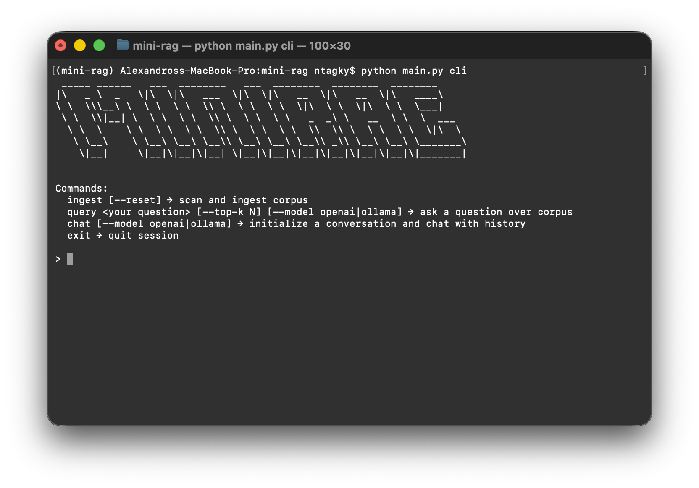
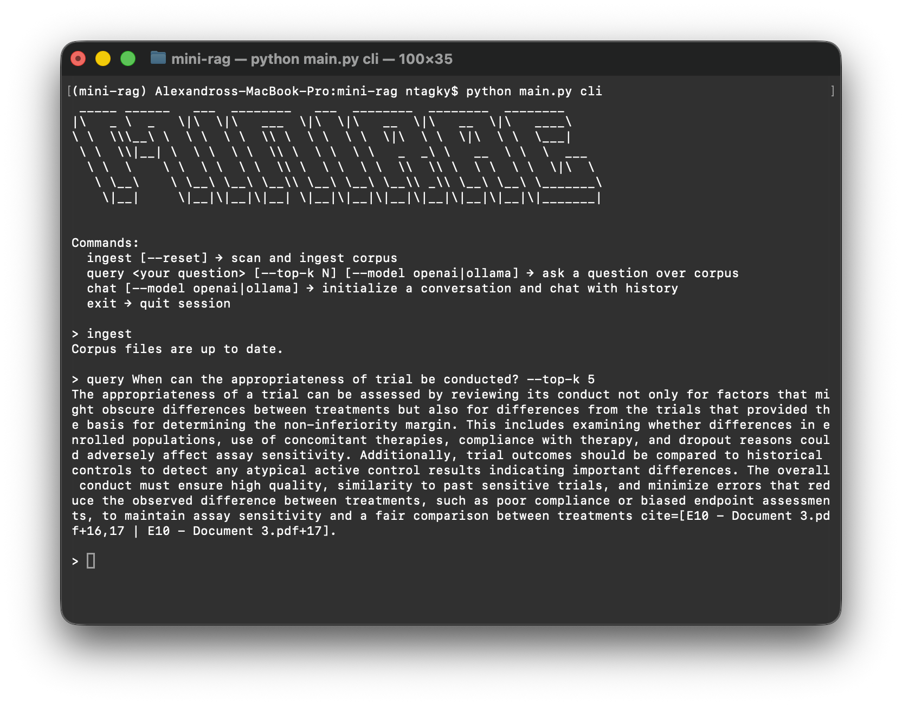
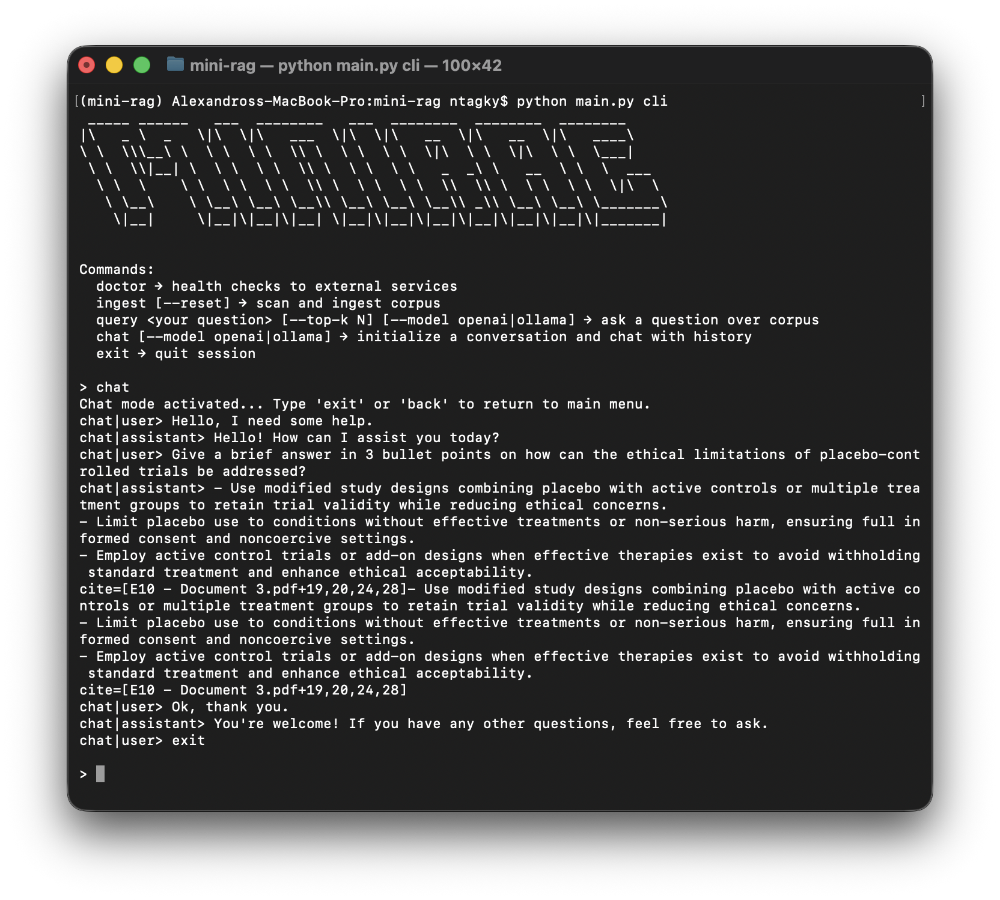
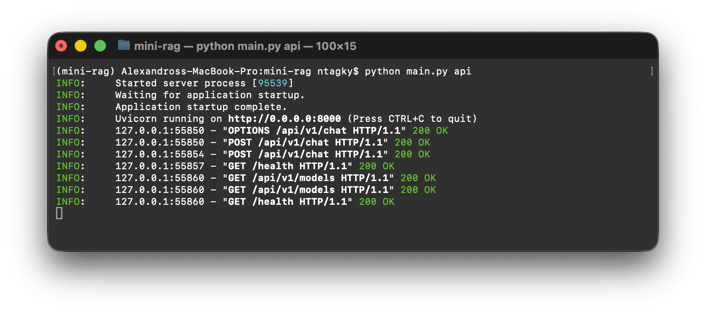
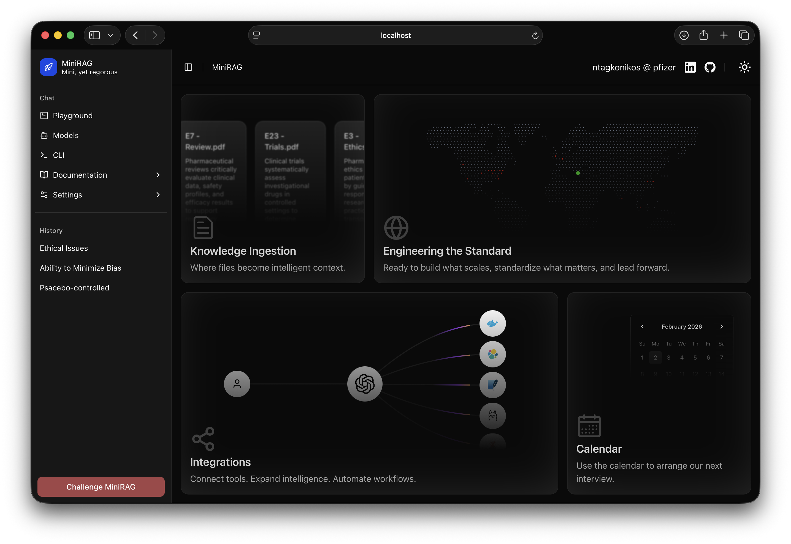
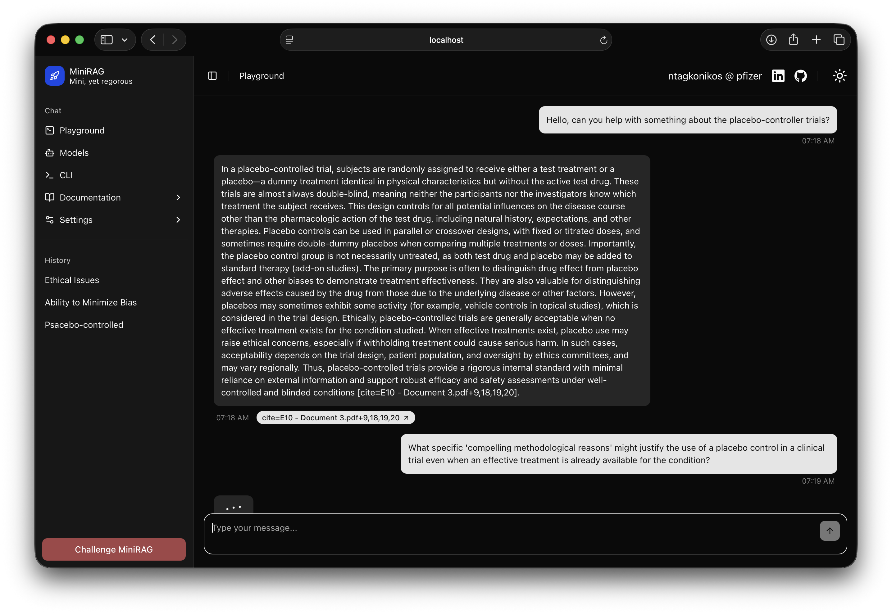
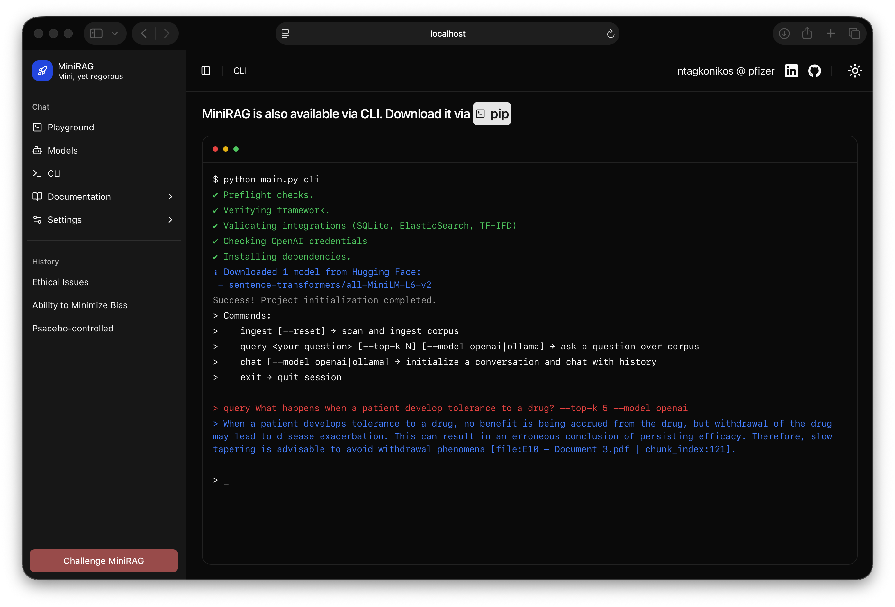

# MiniRAG

A fully local Retrieval-Augmented Generation (RAG) application for ingesting documents, generating embeddings, storing vectors, and querying them through a CLI, API, and optional frontend.

---

## Table of Contents

- [Quick Start](#quick-start)
- [Modes](#modes)
- [Flow](#assumptions)
- [Requests and Responses](#requests-and-responses)
- [Stack](#stack)
- [Frontend](#frontend)

---

## Quick Start

#### 1. Clone Repository

```bash
git clone https://github.com/ntagky/mini-rag.git
cd mini-rag
```

#### 2. Create Environment

Using conda:

```bash
conda create -n mini-rag python=3.11
conda activate mini-rag
pip install -r requirements.txt
```

Using venv:

```bash
python -m venv .venv
source .venv/bin/activate
pip install -r requirements.txt
```

#### 3. Run Docker Compose

Start the services:

```bash
docker compose -f docker-compose.yaml up
```

Run in detached mode: (Recommended)

```bash
docker compose -f docker-compose.yaml up -d
```

#### 4. Create `.env` File

**macOS / Linux**

```bash
echo 'OPENAI_API_KEY="..."' > .env
```

**Windows (PowerShell)**

```powershell
Set-Content -Path .env -Value 'OPENAI_API_KEY="..."'
```

**Windows (Command Prompt)**

```cmd
echo OPENAI_API_KEY="..." > .env
```

## Modes

The application supports two execution modes:

- **cli** — local terminal interaction
- **api** — HTTP endpoints for programmatic access

---

### CLI Mode

Runs as an interactive loop in the terminal with four available commands for managing ingestion and querying.



#### 1. ```ingest [--reset]```
The system performs a full-scale ingestion of the local corpus by using Docling OCR and vision-capable GPT models to extract data, which is then deduplicated via an SQLite registry and chunked for processing. Finally, it creates a robust search layer by storing vector embeddings in Elasticsearch alongside a TF-IDF index for hybrid fallback retrieval.

#### 2. ```query <your question> [--top-k N] [--model openai|ollama]```
Retrieves the top N documents from Elasticsearch and uses the agent with the corresponding model to answer based strictly on the corpus.

#### 3. ```chat [--model openai|ollama]```
Starts a REPL session with short-term memory. The agent maintains context across multiple turns using the SQLite session store.

#### 4. ```exit```
Gracefully terminates the Python session.




### API Mode
The system exposes a RESTful interface for remote integration, allowing external clients to manage models and engage in stateful conversations.


#### 1. ```/health```
Returns the status of the service.
#### 2. ```/api/v1/models```
Lists all available local (Ollama) and remote (OpenAI) models currently configured.
#### 3. ```/api/v1/chat```
Handles conversation logic by passing the message history directly in the request body for stateless execution.

## Requests and Responses

### CLI Mode
#### A.
```bash
$ python main.py cli
...
> query hello, how are you?
Hello! I am here to help you with any questions you have.
```
```json
{
    "trace_id": "5c138061-677c-440e-a5c5-63d10fc0fe19",
    "question": "hello, how are you?",
    "steps": [
      "plan",
      "answer"
    ],
    "directions": {
      "quick_answer": "Hello! I am here to help you with any questions you have.",
      "retrieval_strategy": "vector_only",
      "top_k": 5,
      "draft_style": "concise",
      "citation_style": "footnotes",
      "fallback_threshold": 0.0,
      "query_rewriting": false,
      "keywords": [
        "greeting",
        "salutation",
        "casual"
      ]
    },
    "retrieval": [],
    "latency_ms": {
      "plan": 2279
    },
    "tokens": {},
    "errors": [],
    "answer": "Hello! I am here to help you with any questions you have."
}
```

#### B.
```bash
$ python main.py cli
...
> query What if an employer seeks to enroll employees in a clinical investigation sponsored or conducted by the employer?
If an employer seeks to enroll employees in a clinical investigation sponsored or conducted by the employer, the clinical investigator and IRB must carefully consider potential conflicts of interest and the voluntary nature of consent. According to FDA regulations and guidance, when financial relationships or interests exist—such as an employer sponsoring a study in which employees are subjects—special considerations should be made to mitigate potential undue influence or coercion. These considerations may include:\n\n- Disclosing the source of funding, financial arrangements, or interests related to the employer as sponsor in the informed consent process.\n- Using special measures to modify the informed consent process to ensure voluntariness, such as involving an independent individual without conflicts of interest to obtain consent.\n- Employing independent monitoring of the consent process to protect the rights and welfare of employee-subjects.\n\nThe IRB holds ultimate responsibility for determining if and how such information should be disclosed and whether additional protections are necessary (see 21 CFR 56.109, 56.111(a)(4)-(5)).\n\nIn summary, employer-sponsored clinical investigations involving employees require enhanced scrutiny regarding financial interests, disclosure, and consent to safeguard against conflicts and ensure voluntary participation.\n\ncite=[ICD - Document 1.pdf+42]
```
```json
{
    "trace_id": "4880d510-d180-4a38-8f10-a96cda61b017",
    "question": "What if an employer seeks to enroll employees in a clinical investigation sponsored or conducted by the employer?",
    "steps": [
      "plan",
      "rewriting",
      "retrieve",
      "draft"
    ],
    "directions": {
      "quick_answer": "",
      "retrieval_strategy": "vector+tfidf_fallback",
      "top_k": 5,
      "draft_style": "detailed",
      "citation_style": "footnotes",
      "fallback_threshold": 0.25,
      "query_rewriting": true,
      "keywords": [
        "clinical investigation",
        "employer",
        "employee enrollment"
      ]
    },
    "retrieval": [
      "document-id: ICD - Document 1.pdf, page: 47, chunk-id: def53b75-e478-4aaa-8578-0efabd0fee57, source:Elastic, score:0.85245377",
      "document-id: ICD - Document 1.pdf, page: 47, chunk-id: cda0cf57-09a1-48d3-aa11-0c8296311724, source:Elastic, score:0.8494981",
      "document-id: ICD - Document 1.pdf, page: 42, chunk-id: 8556cc39-ce6c-42a7-9e08-55b2b0dfc9aa, source:Elastic, score:0.8454367",
      "document-id: ICD - Document 1.pdf, page: 50, chunk-id: aec3b26b-1a18-4523-b6c5-880f01a3336d, source:Elastic, score:0.84509987",
      "document-id: ICD - Document 1.pdf, page: 43, chunk-id: e53acd2d-9efd-4578-820a-041a0aa896f4, source:Elastic, score:0.841667"
    ],
    "latency_ms": {
      "plan": 1556,
      "retrieve": 440,
      "draft": 3574,
      "total": 6562
    },
    "tokens": {},
    "errors": [],
    "answer": "If an employer seeks to enroll employees in a clinical investigation sponsored or conducted by the employer, the clinical investigator and IRB must carefully consider potential conflicts of interest and the voluntary nature of consent. According to FDA regulations and guidance, when financial relationships or interests exist—such as an employer sponsoring a study in which employees are subjects—special considerations should be made to mitigate potential undue influence or coercion. These considerations may include:\n\n- Disclosing the source of funding, financial arrangements, or interests related to the employer as sponsor in the informed consent process.\n- Using special measures to modify the informed consent process to ensure voluntariness, such as involving an independent individual without conflicts of interest to obtain consent.\n- Employing independent monitoring of the consent process to protect the rights and welfare of employee-subjects.\n\nThe IRB holds ultimate responsibility for determining if and how such information should be disclosed and whether additional protections are necessary (see 21 CFR 56.109, 56.111(a)(4)-(5)).\n\nIn summary, employer-sponsored clinical investigations involving employees require enhanced scrutiny regarding financial interests, disclosure, and consent to safeguard against conflicts and ensure voluntary participation.\n\ncite=[ICD - Document 1.pdf+42]",
    "citations": [
      "ICD - Document 1.pdf+42"
    ]
  }
```

#### C.
```bash
$ python main.py cli
...
> query What information must consent forms provide regarding medical alternatives and the standard of care for prospective subjects?
Consent forms must disclose appropriate alternative procedures or courses of treatment that might be advantageous to the subject, including a description of the care the subject would likely receive if they do not participate in the research (21 CFR 50.25(a)(4)). This includes approved therapies for the patient's condition, other forms of therapy (e.g., surgical), diagnosis, and when appropriate, supportive care without disease-directed therapy.\n\nThe disclosure must include a description of the current medically recognized standard of care, especially in studies involving medical products intended to treat or diagnose serious diseases or conditions. The standard of care may include uses or treatment regimens of legally marketed drugs or devices that are not included in the product's approved uses. Information about unapproved uses that are part of the medically recognized standard of care can be provided factually but should not be promotional.\n\nIf there are multiple alternatives, the consent form may state that these will be discussed in more detail by the clinical investigator. Treatment options lacking evidence of therapeutic value should generally not be included. Disclosure should include reasonably foreseeable risks or discomforts and potential benefits associated with these alternatives during the informed consent process, although detailed risk/benefit explanation need not always be in the written consent form.\n\nIt may be appropriate to refer subjects to their primary care provider or another healthcare professional for more complete discussion of alternatives before signing the consent form.\n\nThe person obtaining consent must be able to discuss available alternatives and answer questions from prospective subjects, and consent documents and discussions may need updating if new alternative treatments become available during the trial cite=[ICD - Document 1.pdf+19,20].
```
```json
{
    "trace_id": "6d42e1b4-3121-40e3-9db5-6d942ca7a301",
    "question": "What information must consent forms provide regarding medical alternatives and the standard of care for prospective subjects?",
    "steps": [
      "plan",
      "rewriting",
      "retrieve",
      "draft"
    ],
    "directions": {
      "quick_answer": "",
      "retrieval_strategy": "vector_only",
      "top_k": 5,
      "draft_style": "detailed",
      "citation_style": "footnotes",
      "fallback_threshold": 0.1,
      "query_rewriting": true,
      "keywords": [
        "consent forms",
        "medical alternatives",
        "standard of care"
      ]
    },
    "retrieval": [
      "document-id: ICD - Document 1.pdf, page: 19, chunk-id: a9d942cc-e02a-4ca4-98c9-c87f0f009d12, source:Elastic, score:0.8825654",
      "document-id: ICD - Document 1.pdf, page: 20, chunk-id: 50eb592c-6e2e-4f5a-bc37-e93f4b35c077, source:Elastic, score:0.86510485",
      "document-id: ICD - Document 1.pdf, page: 17, chunk-id: 09b13f4c-a989-47e3-8c69-a3268676f2b1, source:Elastic, score:0.8455529",
      "document-id: ICD - Document 1.pdf, page: 17, chunk-id: 9e9571cf-6429-44ad-a5ad-5a3b057bbec2, source:Elastic, score:0.8444456",
      "document-id: ICD - Document 1.pdf, page: 22, chunk-id: 938de88d-e627-4380-89e2-3c23cc842674, source:Elastic, score:0.8437773"
    ],
    "latency_ms": {
      "plan": 1747,
      "retrieve": 462,
      "draft": 5330,
      "total": 8437
    },
    "tokens": {},
    "errors": [],
    "answer": "Consent forms must disclose appropriate alternative procedures or courses of treatment that might be advantageous to the subject, including a description of the care the subject would likely receive if they do not participate in the research (21 CFR 50.25(a)(4)). This includes approved therapies for the patient's condition, other forms of therapy (e.g., surgical), diagnosis, and when appropriate, supportive care without disease-directed therapy.\n\nThe disclosure must include a description of the current medically recognized standard of care, especially in studies involving medical products intended to treat or diagnose serious diseases or conditions. The standard of care may include uses or treatment regimens of legally marketed drugs or devices that are not included in the product's approved uses. Information about unapproved uses that are part of the medically recognized standard of care can be provided factually but should not be promotional.\n\nIf there are multiple alternatives, the consent form may state that these will be discussed in more detail by the clinical investigator. Treatment options lacking evidence of therapeutic value should generally not be included. Disclosure should include reasonably foreseeable risks or discomforts and potential benefits associated with these alternatives during the informed consent process, although detailed risk/benefit explanation need not always be in the written consent form.\n\nIt may be appropriate to refer subjects to their primary care provider or another healthcare professional for more complete discussion of alternatives before signing the consent form.\n\nThe person obtaining consent must be able to discuss available alternatives and answer questions from prospective subjects, and consent documents and discussions may need updating if new alternative treatments become available during the trial cite=[ICD - Document 1.pdf+19,20].",
    "citations": [
      "ICD - Document 1.pdf+19,20"
    ]
  }
```

### API Mode
#### A.
```bash
curl -X 'POST' \
  'http://localhost:8000/api/v1/chat' \
  -H 'accept: application/json' \
  -H 'Content-Type: application/json' \
  -d '{
  "messages": [
    {
      "role": "user",
      "content": "Who must be listed as contacts in the consent document, and why does the FDA recommend a separate contact for questions regarding subjects'\'' rights?"
    }
  ],
  "model": "openai"
}'
```
```json
{
  "content": "The consent document must list contacts for:  \n1. Answers to pertinent questions about the research.  \n2. Questions about subjects' rights.  \n3. Contact in the event of a research-related injury.  \n\nThis information should include names (or offices), email addresses, and telephone numbers.\n\nThe FDA recommends a separate contact for questions regarding subjects' rights who is not part of the investigational team because subjects may hesitate to report concerns or problems to someone involved in the investigation. Such contacts can include the IRB Office, Patient Advocate Office, or other trained staff regarding subjects' rights.  \n\nAdditionally, the consent process should provide emergency contact information, including 24-hour contact if appropriate. If contact information changes during the study, updated contacts must be provided to subjects (21 CFR 50.25(a)(7)) [cite=ICD - Document 1.pdf+23].",
  "citations": [
    "cite=ICD - Document 1.pdf+23"
  ]
}
```

#### B.
```bash
curl -X 'POST' \
  'http://localhost:8000/api/v1/chat' \
  -H 'accept: application/json' \
  -H 'Content-Type: application/json' \
  -d '{
  "messages": [
      {
      "role": "user",
      "content": "Hello, I need your help."
    },
    {
      "role": "assistant",
      "content": "Hi! How can I help you?"
    },
    {
      "role": "user",
      "content": "In what specific clinical scenarios is a randomized withdrawal study design most effective for determining long-term efficacy and treatment duration?"
    }
  ],
  "model": "openai"
}'
```
```json
{
  "content": "Randomized withdrawal study designs are most effective in the following clinical scenarios for determining long-term efficacy and treatment duration:\n\n1. **Relapse-Prevention in Recurring Illnesses:** For drugs that resolve episodes of recurring illnesses such as antidepressants, randomized withdrawal acts as a relapse-prevention study by comparing continued treatment to withdrawal to placebo.\n\n2. **Symptom or Sign Suppression:** For conditions where symptoms or signs (e.g., chronic pain, hypertension, angina) are suppressed by the drug, and where a long-term placebo-controlled trial is difficult or unethical, the design can establish long-term efficacy.\n\n3. **Determining Treatment Duration:** Particularly useful for therapies requiring guidance on length of treatment, such as post-infarction beta-blocker therapy, by randomizing responders to continued treatment or placebo to evaluate persistence of benefit.\n\nAdditionally, such trials can address dosing issues by randomizing responders to multiple doses or placebo after an initial fixed-dose phase to study dose-response and maintenance dose efficacy.\n\nThe design is especially beneficial when long-term placebo exposure is not ethical since the withdrawal phase can be short and incorporate early escape for patients who relapse or worsen.\n\nKey considerations include avoiding withdrawal phenomena through slow tapering and acknowledging that efficacy estimates may be higher due to enrichment with responders who tolerate the drug well.\n\ncite=[E10 - Document 3.pdf+22,23]",
  "citations": [
    "E10 - Document 3.pdf+22,23"
  ]
}
```

#### C.
```bash
curl -X 'POST' \
  'http://localhost:8000/api/v1/chat' \
  -H 'accept: application/json' \
  -H 'Content-Type: application/json' \
  -d '{
  "messages": [
      {
      "role": "user",
      "content": "Hello, I need your help."
    },
    {
      "role": "assistant",
      "content": "Hi! How can I help you?"
    },
    {
      "role": "user",
      "content": "In what specific clinical scenarios is a randomized withdrawal study design most effective for determining long-term efficacy and treatment duration?"
    },
    {
      "role": "assistant",
      "content": "Randomized withdrawal study designs are most effective in the following clinical scenarios for determining long-term efficacy and treatment duration:\n\n1. **Relapse-Prevention in Recurring Illnesses:** For drugs that resolve episodes of recurring illnesses such as antidepressants, randomized withdrawal acts as a relapse-prevention study by comparing continued treatment to withdrawal to placebo.\n\n2. **Symptom or Sign Suppression:** For conditions where symptoms or signs (e.g., chronic pain, hypertension, angina) are suppressed by the drug, and where a long-term placebo-controlled trial is difficult or unethical, the design can establish long-term efficacy.\n\n3. **Determining Treatment Duration:** Particularly useful for therapies requiring guidance on length of treatment, such as post-infarction beta-blocker therapy, by randomizing responders to continued treatment or placebo to evaluate persistence of benefit.\n\nAdditionally, such trials can address dosing issues by randomizing responders to multiple doses or placebo after an initial fixed-dose phase to study dose-response and maintenance dose efficacy.\n\nThe design is especially beneficial when long-term placebo exposure is not ethical since the withdrawal phase can be short and incorporate early escape for patients who relapse or worsen.\n\nKey considerations include avoiding withdrawal phenomena through slow tapering and acknowledging that efficacy estimates may be higher due to enrichment with responders who tolerate the drug well.\n\ncite=[E10 - Document 3.pdf+22,23]"
    },
    {
      "role": "user",
      "content": "Okay, and how can sponsors distinguish between the data listings for '\''Deaths'\'' and '\''Other Serious Adverse Events'\'' to avoid the risk of double counting fatal outcomes?"
    }
  ],
  "model": "openai"
}'
```
```json
{
  "content": "Sponsors should include all deaths in the data listing under section 12.3.1.1 (Deaths), which captures all deaths during the study and post-treatment follow-up, including deaths resulting from processes that began during the study. The listing for section 12.3.1.2 (Other Serious Adverse Events) includes serious adverse events other than death but may include events temporally associated with or preceding deaths. While deaths may appear in both listings, this does not result in double counting or miscounting because any fatal event listed as an \"other serious adverse event\" would also be captured under the \"Deaths\" listing. Thus, deaths are explicitly recorded once in the Deaths section, and any associated serious adverse events with fatal outcomes can also appear in the Other Serious Adverse Events section without duplication of the death count. \n\ncite=[E3 Structure - Document 2.pdf+8]",
  "citations": [
    "E3 Structure - Document 2.pdf+8"
  ]
}
```

### Stack

| Category               | Technology | Role                                                 |
|:-----------------------| :--- |:-----------------------------------------------------|
| **Orchestration**      | Docker Compose | Containerization & environment parity                |
| **Search Engine**      | Elasticsearch 9.2.4 | Vector Database & similarity retrieval               |
| **Database (Local)**   | SQLite | Lightweight relational storage for corpus management |
| **Inference (Local)**  | Ollama (Llava:7b) | Multi-modal (Vision + Text) reasoning                    |
| **Inference (Cloud)**  | OpenAI GPT-4o-mini | Multi-modal (Vision + Text) reasoning                   |
| **Data Ingestion**     | Docling (IBM) | Advanced document parsing (PDF/DOCX to Markdown/JSON) |
| **Embeddings (Local)** | BAAI/BGE-Base-En-v1.5 | High-performance local text vectorization via Sentence Transformers |
| **Embeddings (Cloud)**        | text-embedding-3-small | Generating high-dimensional vector representations   |
| **Backend**            | Python 3.11 | Agent logic, LangChain/LlamaIndex orchestration      |
| **Frontend**           | Next.js | Modern web interface for the agent chat              |
| **Legacy Search**      | TF-IDF | Basic keyword frequency analysis for comparison      |
| **Hugg**               | Kibana 9.2.4 | Data visualization and index management              |
| **Monitoring**         | Kibana 9.2.4 | Data visualization and index management              |

## Frontend

The frontend is a modern Next.js application that serves as the primary user interface for the RAG system. It features a responsive chat interface where users can interact with the agent in real-time. A key feature is the model switcher, allowing users to toggle between OpenAI (GPT-4o-mini) for high-level reasoning and Ollama (Llava:7b) for local or vision-based tasks.

### Setup

#### 1. Enter Frontend
```bash
cd frontend
```

#### 2. Install Deps
```bash
bun install
```

#### 3. Spin Up:
```bash
bun --bun run dev
```




